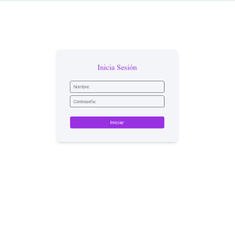
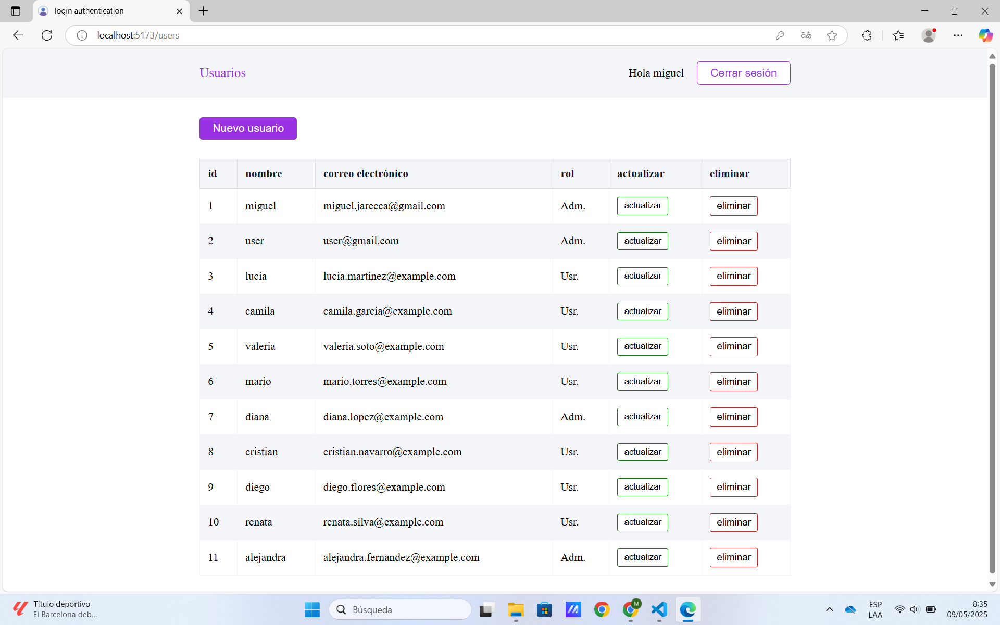

# Login Authentication

Este es un proyecto de autenticación desarrollado como práctica del curso **"React + Spring: Creando WebApp Full Stack"** de Udemy. El objetivo principal es demostrar cómo implementar un sistema de login seguro con control de acceso basado en roles (`USER` y `ADMIN`).

---

## Tecnologías utilizadas

### Frontend
- React
- Redux Toolkit
- React Hooks

### Backend
- Java con Spring Boot
- Spring Security
- JWT (JSON Web Tokens)
- API REST
- Arquitectura MVC

### Base de datos
- MySQL

---

## Funcionalidades

- Inicio de sesión con autenticación por token JWT.
- Control de acceso por roles (`USER` y `ADMIN`).
- CRUD completo de usuarios (solo accesible para administradores).
- Protección de rutas según permisos.
- Almacenamiento del token para mantener sesión activa.

---

## Capturas de Pantalla

1. **Login**:
      

2. **Usuarios**:
      

---

## 📁 Estructura del proyecto

login-authentication/
├── frontend/ # Aplicación React
└── backend/ # API REST con Spring Boot

---

## 🚀 Cómo ejecutar el proyecto localmente

### Requisitos previos
- Node.js
- Java JDK 17 o superior
- MySQL
- Maven
- Visual Studio Code o cualquier editor compatible con Java

### 1. Clona el repositorio
```bash
# Clonar este proyecto en tu máquina local
git clone https://github.com/tuusuario/login-authentication.git

# Navegar al directorio del proyecto
cd login-authentication
```

### 2. Frontend - React
```bash
# Navegar al directorio del frontend
$ cd frontend

# Instalar dependencias
$ npm install

# Ejecutar la aplicación
$ npm start
```
La aplicación estará disponible en: `http://localhost:5173`

#### 3. Crear la base de datos en MySql

```sql
-- Crear la base de datos 
CREATE DATABASE IF NOT EXISTS db_users_springboot;

-- Insertar roles por defecto
INSERT INTO roles (id, name) VALUES
(1, 'ROLE_ADMIN'),
(2, 'ROLE_USER');

-- Crear usuario "admin"
INSERT INTO users (username, password, email)
VALUES ('admin', '$2a$10$kTfYk6O0UZ5fCZT15hD1eOYz7GeiOZq09sbsyhJ3nG9I1jFY0UZIa', 'admin@example.com');

-- Asignar roles al usuario "admin"
INSERT INTO users_roles (user_id, role_id) VALUES
(1, 1), -- ROLE_ADMIN
(1, 2); -- ROLE_USER
```

##### Datos de acceso predeterminados 
- **usuario:** `admin`
- **contraseña:** `admin123`

#### 4. Configuración del Backend

1. Abrir el proyecto en tu IDE (Visual Studio Code u otro).
2. Ejecutar la clase principal del proyecto `Application.java`.
3. El backend estará disponible en: `http://localhost:8080`

---

## Contacto

Para más información o preguntas:
- **LinkedIn**: [Miguel Jarecca - LinkedIn](https://www.linkedin.com/in/migueljarecca/)
- **GitHub**: [Miguel Jarecca - GitHub](https://github.com/MiguelJarecca)
- **Portafolio**: [Miguel Jarecca - Portafolio](https://migueljarecca.github.io/portafolio-miguel/)

